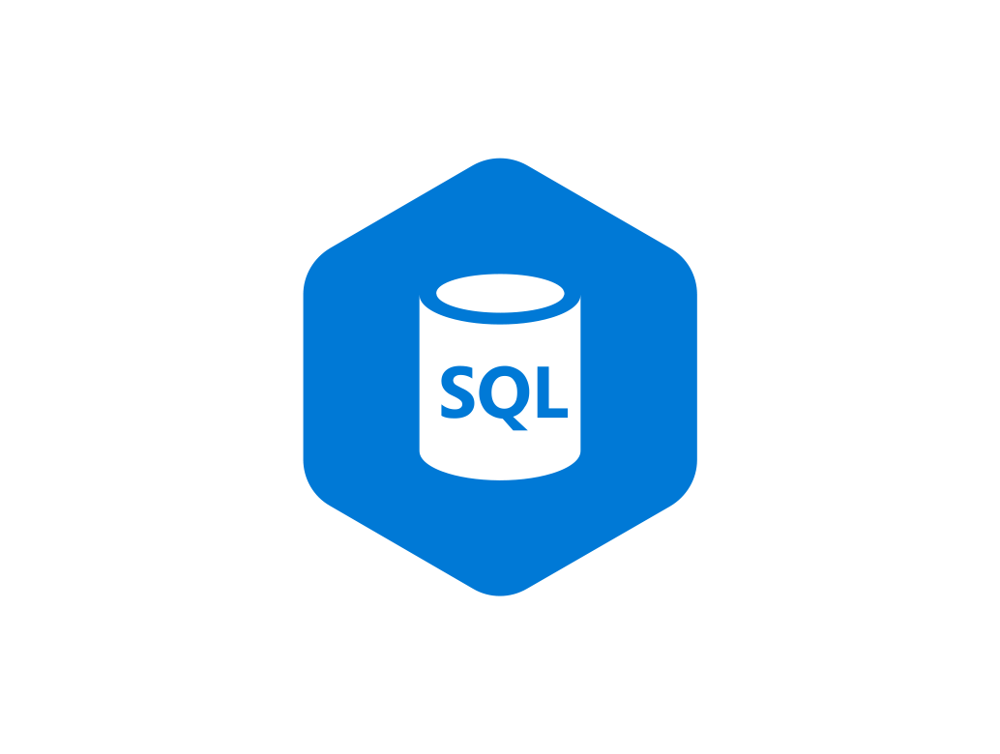

# SQL business cases

  

**Herramientas utilizadas:**

- PostgreSQL
- SQL
- DBeaver

**Objetivo del proyecto (formación):**

El objetivo principal fue familiarizarme y practicar con la realización de consultas SQL de diferente complejidad para ganar fluidez con la herramienta y enfrentarme a distintos escenarios de análisis de datos.

Durante el proyecto se resolvieron un total de 64 consultas, abordando diferentes problemas y casos de negocio.

**Metodología:**

En primer lugar, se analizó la estructura de la base de datos para comprender las relaciones existentes entre las diferentes tablas.Posteriormente, para cada consulta se evaluaron distintas alternativas de resolución, buscando un equilibrio entre la optimización de la consulta y el aprendizaje de diferentes enfoques y técnicas SQL. Antes de desarrollar cada query, definía el objetivo a resolver y analizaba las posibles estrategias para llegar al resultado, verificando posteriormente la coherencia y validez de los datos obtenidos.

**Archivos en el repositorio:**

- Diagrama
- README
- logo SQL
- Script con preguntas y Queries resueltas

**Autor** : Javier Bartolomé Jalvo
